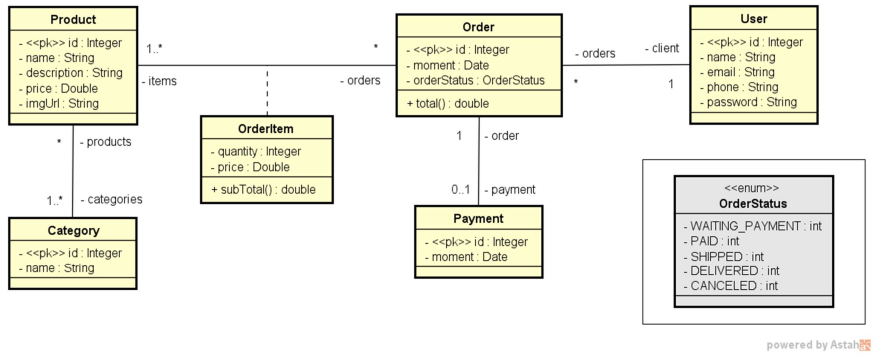

<h1 align="center">
    :sparkles:About the project:sparkles:
</h1>

***
**Course:** Java completo <br>
**Orders Spring Boot application** <br>
Java EE notion notes: https://alessiacasado.notion.site/Java-EE-1c47af0f8e004813a08580a4a6d2379c

#### Technologies
- Java 17
- Spring boot 3.x
- H2

<div align="center">
    <h3>
        Diagram
    </h3>
    
</div>

## Postman outcome
_localhost:8080/orders/1_
```
{
    "id": 1,
    "moment": "2019-06-20T19:53:07Z",
    "orderStatus": "PAID",
    "client": {
        "id": 1,
        "name": "Maria Brown",
        "email": "maria@gmail.com",
        "phone": "988888888",
        "password": "123456"
    },
    "items": [
        {
            "quantity": 2,
            "price": 90.5,
            "subTotal": 181.0
        },
        {
            "quantity": 1,
            "price": 1250.0,
            "subTotal": 1250.0
        }
    ],
    "payment": {
        "id": 1,
        "moment": "2019-06-20T21:53:07Z"
    },
    "total": 1431.0
}
```